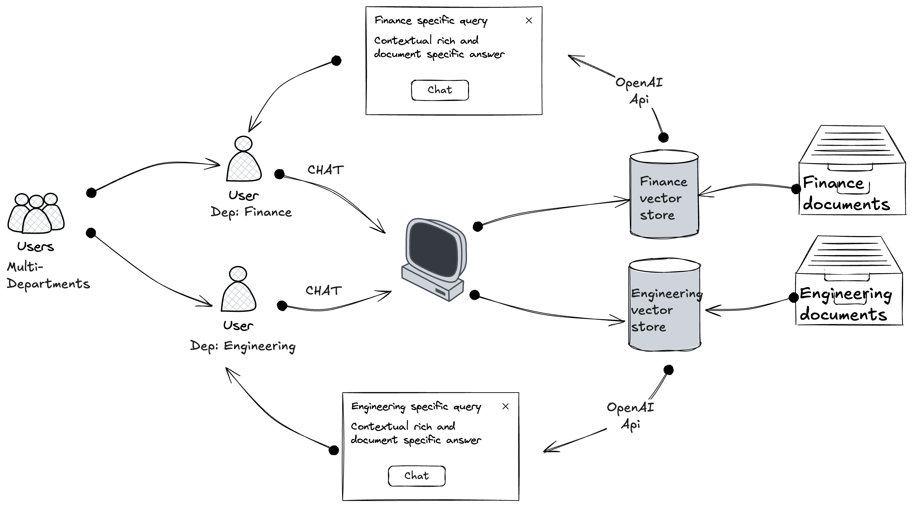

# Role-Based RAG System

A secure document management and retrieval system with role-based access controls and retrieval-augmented generation capabilities.

## Overview

This project implements a role-based access control system for document management and retrieval using Retrieval-Augmented Generation (RAG). Users can chat with interface that provides contextually relevant answers based on the accessible documents for their role.

## Key Features

- **Role-Based Access Control**: Different user types have access to different sets of documents
- **Secure Authentication**: Password hashing, account lockout protection, and session management
- **Vector Document Storage**: Documents are stored and retrieved using semantic search via embeddings
- **RAG-Powered Chat**: Chat interface that leverages document context to provide informed responses
- **Rate Limiting**: Protection against excessive requests
- **Admin Interface**: Management of users and documents through a dedicated admin panel

## Technical Stack

- **Frontend**: Gradio for the web interface
- **Vector Database**: ChromaDB for document storage and retrieval
- **Embeddings**: OpenAI's text-embedding-ada-002
- **Chat Completions**: GPT-3.5 Turbo
- **Authentication**: Custom session-based authentication system

## System Architecture

The system consists of several key components:

1. **UserAuth**: Handles user authentication, session management, and role assignment
2. **VectorDocumentStore**: Manages document storage, embedding, and retrieval
3. **RAGChat**: Processes user queries against relevant documents to generate contextual responses
4. **RateLimiter**: Prevents abuse by limiting request frequency
5. **Main Application**: Ties everything together with a Gradio-based UI

## Getting Started

### Installation

1. Clone the repository
2. Install dependencies:
   ```bash
   pip install -r requirements.txt
   ```
3. Create a `.env` file with your OpenAI API key:
   ```
   OPENAI_API_KEY=your_api_key_here
   ```

### Running the Application

```bash
python app.py
```

The system will initialize with default users:
- admin (password: admin123)

## Usage

1. Log in with appropriate credentials
2. Navigate to the Chat tab to interact with the RAG system
3. Ask questions relevant to your role's documents
4. Admin users can manage users and documents through the Admin tab
